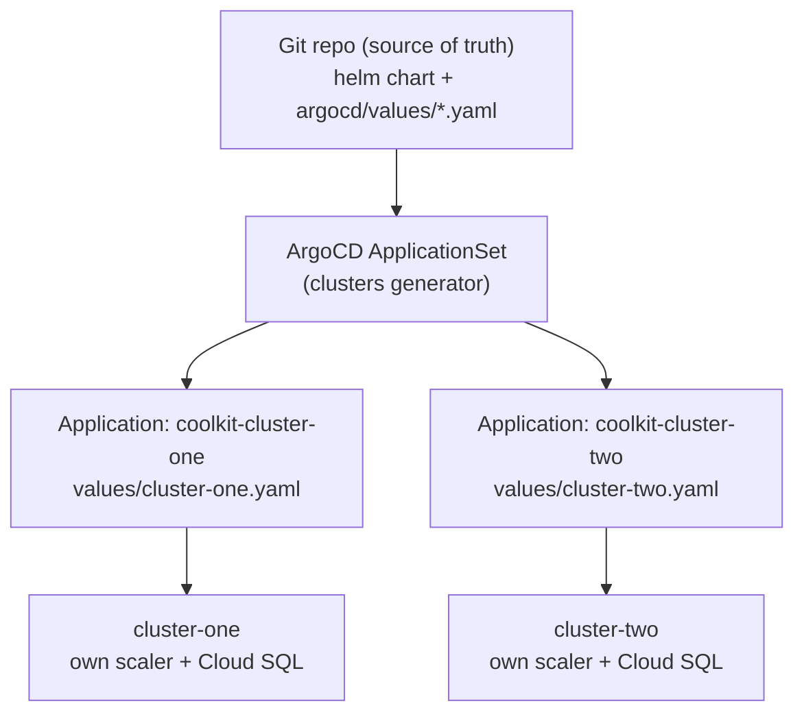

# coolkit — Scaling to more than one Cluster
Currently coolkit is a single plain `Application` deployed in-cluster.
To add a second cluster, register the cluster with ArgoCD and let **one
`ApplicationSet`** stamp out an `Application` per registered target.



The `clusters` generator iterates over every cluster **registered on ArgoCD** (labeled `env: prod`)
and installs the *same* chart with a per-cluster values overlay. **Adding a cluster = register it + add one
`argocd/values/<cluster>.yaml`.** No per-cluster manifest copy-paste.

## Example ApplicationSet

```yaml
apiVersion: argoproj.io/v1alpha1
kind: ApplicationSet
metadata:
  name: coolkit
  namespace: argocd
spec:
  goTemplate: true
  generators:
  - clusters:
      selector:
        matchLabels:
          env: prod          # matches cluster-one, cluster-two, …
  template:
    metadata:
      name: 'coolkit-{{.name}}'   # -> coolkit-cluster-one, coolkit-cluster-two
    spec:
      project: default
      sources:
      - repoURL: https://github.com/octaviobr/coolkit.git
        targetRevision: main
        ref: values
      - repoURL: https://github.com/octaviobr/coolkit.git
        targetRevision: main
        path: helm
        helm:
          valueFiles:
          - '$values/argocd/values/{{.name}}.yaml'   # per-cluster overlay
      destination:
        server: '{{.server}}'    # the registered cluster's API endpoint
        namespace: production
      syncPolicy:
        automated: { prune: true, selfHeal: true }
        syncOptions: [CreateNamespace=true, ApplyOutOfSyncOnly=true]
```

`{{.name}}` and `{{.server}}` come from each ArgoCD-registered cluster, so one `ApplicationSet` covers the whole
fleet — register `cluster-two` and its `Application` appears automatically.

